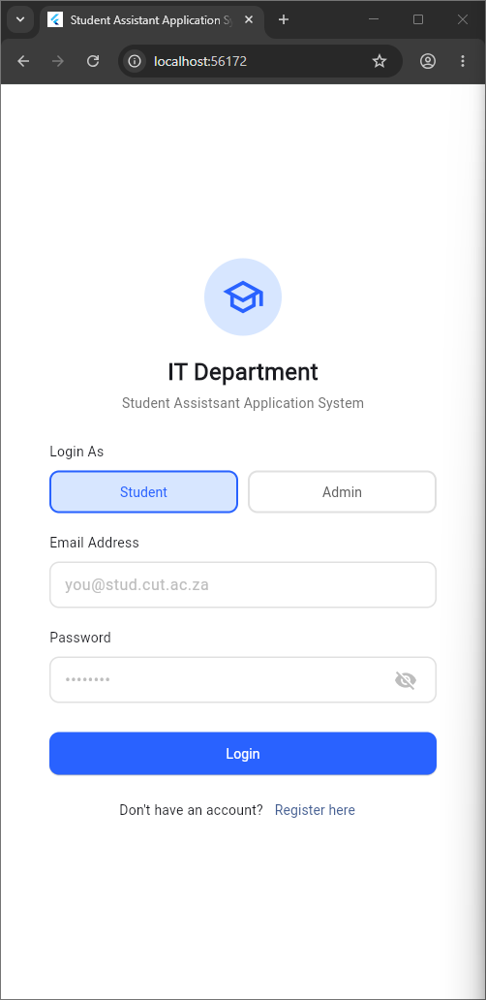
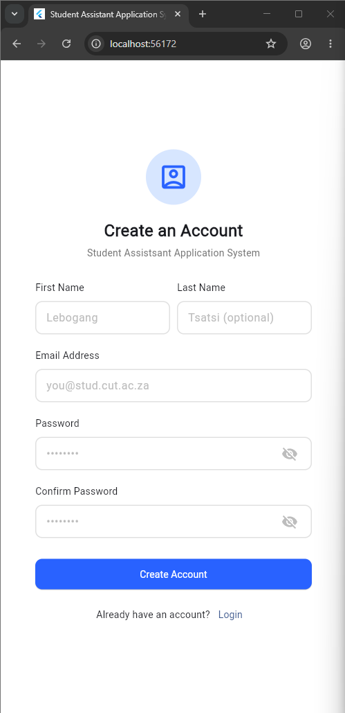
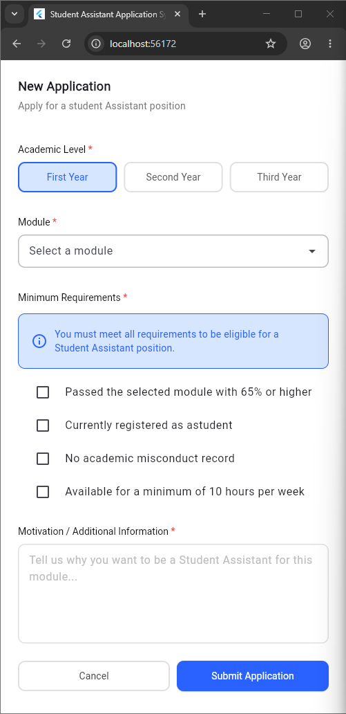
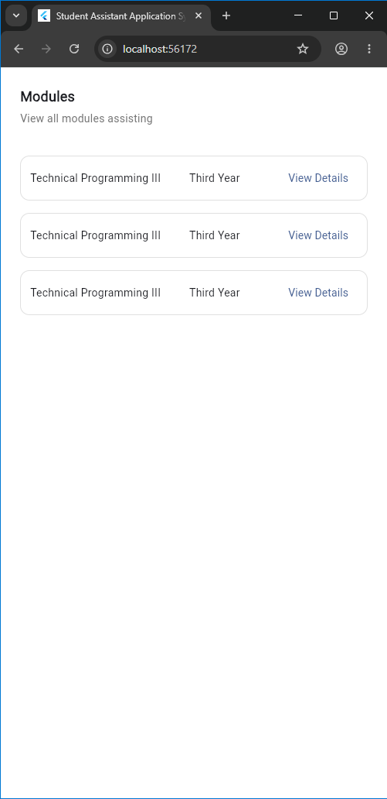

# Student Assistant Application

A simple student assistant application designed to help manage and streamline student-related tasks.

## Features
- Modules management
- Application submission
- Morden and clean UI
- Lightweight and fast

## Preview

<p float="left">
  <h4>Authentication</h4>
  
  
</p>

<p float="right">
  <h4>Student Assistant</h4>
  
  
</p>

## Tech Stack
- Flutter and Dart 
- Provider
- Supabase

## Getting Started

```bash
git clone https://github.com/BlueWidgetStudio/student-assistant-app.git
cd student-assistant-app
flutter pub get
flutter run
